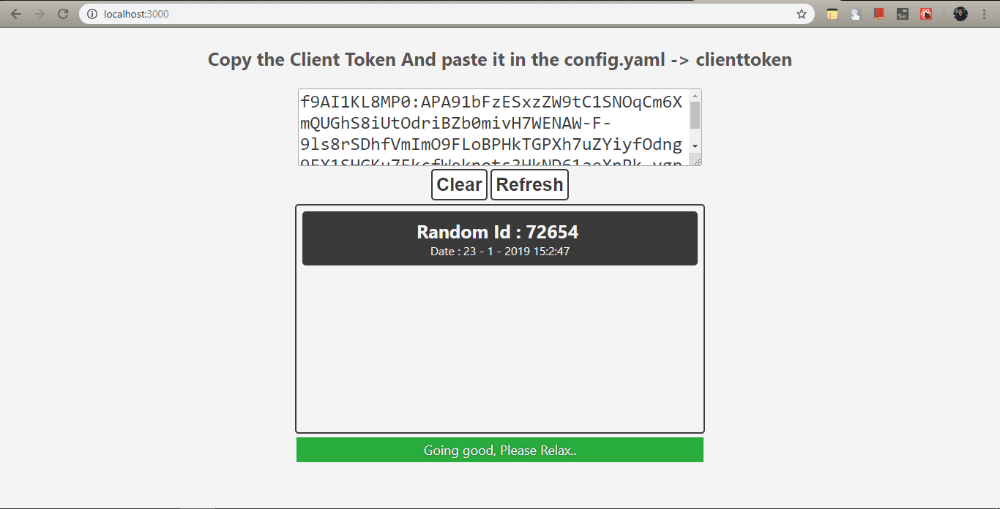
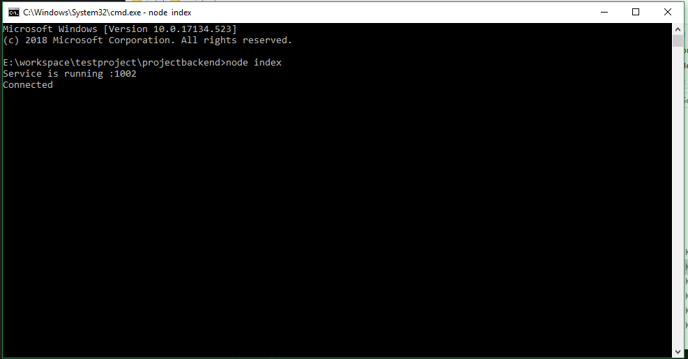

# Projectbackend - for 3bees.io

### Objective : 

   	1. Should support below functionalities.
          	1. Insert record every 10mins.
          	2. Send push notification to the client.
          	3. Provide all the records to the client using API.
          	4. Remove entire record form MYSQL database.

### Configuration : 

 	1. Configuration file location :  projectbackend\config.yaml 
 	2. Attributes and its purpose:
      	1. port : Based on this value only the port will be assigned to this service.
      	2. clienttoken :  To send push notification client it was mandatory based on the google document. Please refer projectui -> Projectui - 3bees.MD file. This value you can kept from UI. 
           	1. 
      	3. serverKey :  This is an important key which defines a sender. You can get it from FCM console -> cloud messaging.
	3. Database configuration : 
    	1. Config file location :  projectbackend\config\config.js
    	2. Table name should be **test**. **[ #NOTE]**.
    	3. **MYSQL QUERY  :**  CREATE TABLE IF NOT EXISTS `test` (
          `id` varchar(50) NOT NULL,
          `createtime` varchar(50) NOT NULL

        ) ENGINE=MyISAM DEFAULT CHARSET=latin1;

### Pre-requirement :

​	Before start running the project these are the mandatory steps has to be followed.

    1. Enter command to pull all the npm modules
          1. **npm install**
     		1. CMD >  **node index**
    	5. Copy the Client Token And paste it in to the config.yaml .(under nodejs backend project -> config.yaml -> clienttoken)

### Sample Image : 

1. Service running fine. Database connected successfully.

​	

# 			    				THANK YOU